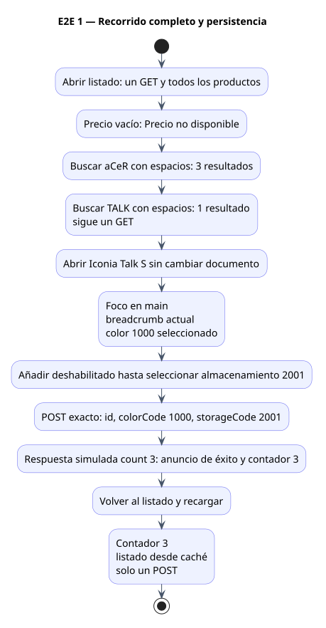
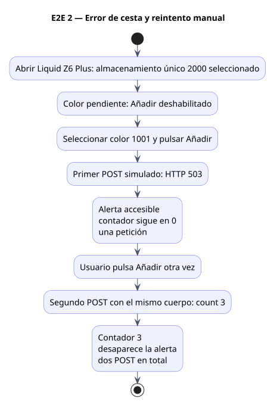
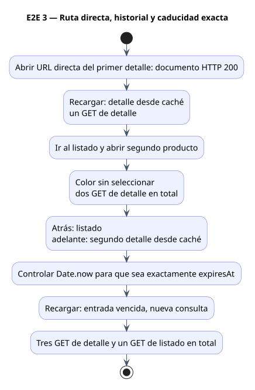
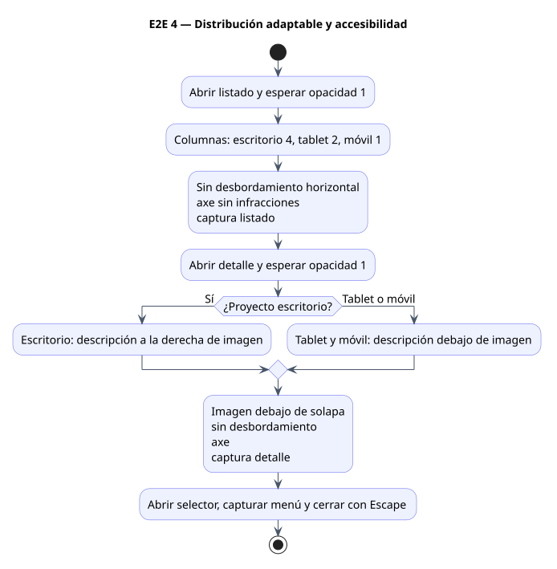
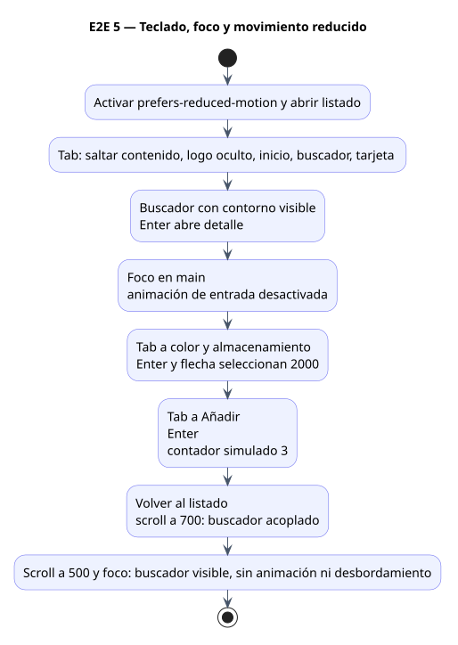
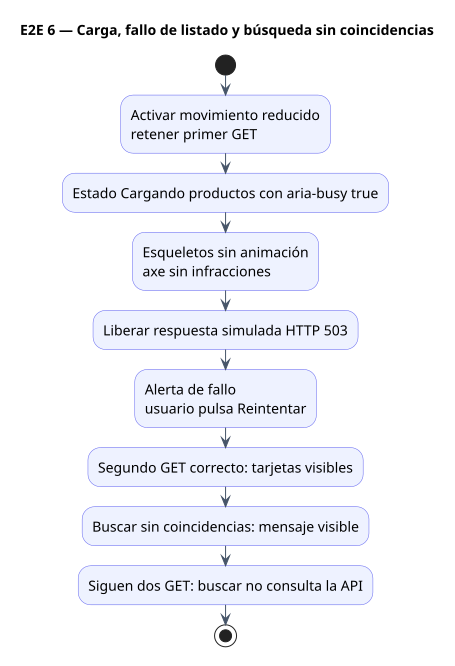
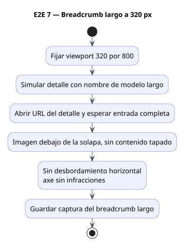
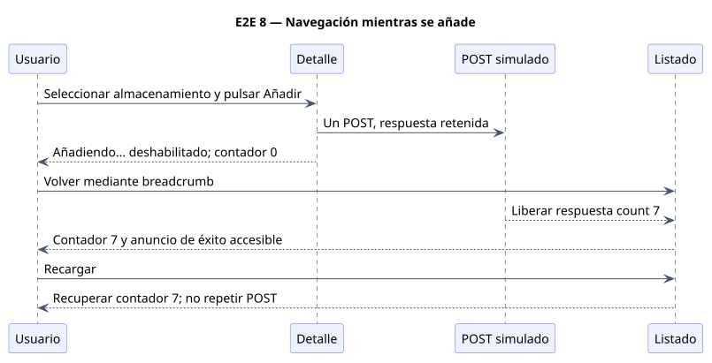
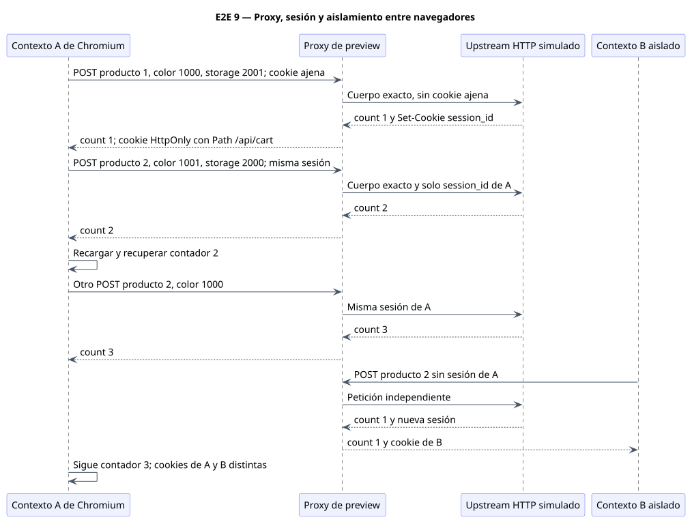

# Diagramas de las pruebas E2E

Estos diagramas describen las nueve pruebas implementadas en [application.spec.ts](../e2e/application.spec.ts) y [cart-session.spec.ts](../e2e/cart-session.spec.ts). Las imágenes SVG se renderizan localmente con PlantUML; se conservan las fuentes `.puml` editables y copias PNG de cada escenario.

La última ejecución aprobó **27 pruebas**: nueve escenarios en Chromium para escritorio (1440 × 900), tablet (768 × 1024) y móvil (360 × 800). El escenario de breadcrumb largo fija 320 × 800 en los tres proyectos. No son ejecuciones en Brave, Zen, Firefox ni Safari.

Todas las E2E usan respuestas simuladas y no dependen de la API pública. Los primeros ocho escenarios interceptan las peticiones en Playwright. El noveno utiliza el proxy real de preview y un upstream de cesta simulado. Los valores 3 y 7 de las respuestas interceptadas son datos de prueba, no acumulaciones observadas en la API real.

## 1. Recorrido completo y persistencia

Comprueba todos los productos, precio vacío, búsqueda por marca y modelo sin nuevas consultas, navegación sin recargar el documento, foco y breadcrumb, selección obligatoria, cuerpo POST exacto y contador persistente.



[Fuente PlantUML](diagrams/e2e/01-recorrido-completo.puml) · [Imagen PNG](diagrams/e2e/01-recorrido-completo.png)

## 2. Error de cesta y reintento manual

Comprueba que la selección incompleta bloquea Añadir, un fallo conserva el contador, el mensaje pasa la comprobación de accesibilidad y únicamente otra acción del usuario vuelve a enviar el POST.



[Fuente PlantUML](diagrams/e2e/02-error-cesta.puml) · [Imagen PNG](diagrams/e2e/02-error-cesta.png)

## 3. Ruta directa, historial y caducidad exacta

Comprueba el fallback SPA de preview, la caché independiente por producto, la selección de color pendiente en el segundo producto y una nueva consulta justo al alcanzar expiresAt, sin esperar una hora real.



[Fuente PlantUML](diagrams/e2e/03-rutas-cache.puml) · [Imagen PNG](diagrams/e2e/03-rutas-cache.png)

## 4. Distribución adaptable y accesibilidad

Comprueba columnas, posiciones y ausencia de desbordamiento horizontal. Axe analiza las etiquetas WCAG A/AA incluidas una vez finalizada la animación de entrada; no equivale a una certificación integral.



[Fuente PlantUML](diagrams/e2e/04-distribucion.puml) · [Imagen PNG](diagrams/e2e/04-distribucion.png)

## 5. Teclado, foco y movimiento reducido

Comprueba el recorrido de tabulación, la selección por teclado, la entrada sin animación y el buscador acoplado y visible al recuperar el foco.



[Fuente PlantUML](diagrams/e2e/05-teclado.puml) · [Imagen PNG](diagrams/e2e/05-teclado.png)

## 6. Carga, fallo de listado y búsqueda sin coincidencias

La respuesta inicial se retiene para inspeccionar los esqueletos. Su carga se anuncia a tecnologías de asistencia aunque no se muestre la palabra «Cargando» en pantalla.



[Fuente PlantUML](diagrams/e2e/06-carga-error.puml) · [Imagen PNG](diagrams/e2e/06-carga-error.png)

## 7. Breadcrumb largo a 320 px

Se sustituye el modelo del fixture por un nombre largo para comprobar que el encabezado reserva suficiente espacio.



[Fuente PlantUML](diagrams/e2e/07-breadcrumb.puml) · [Imagen PNG](diagrams/e2e/07-breadcrumb.png)

## 8. Navegación mientras se añade

El POST se mantiene pendiente hasta que el usuario vuelve al listado. La respuesta se aplica al estado compartido y el contador sobrevive a la recarga.



[Fuente PlantUML](diagrams/e2e/08-navegacion-pendiente.puml) · [Imagen PNG](diagrams/e2e/08-navegacion-pendiente.png)

## 9. Proxy, sesión y aislamiento entre navegadores

GET e imágenes siguen interceptados; los POST atraviesan el proxy real de preview hacia [cart-session-server.mjs](../e2e/cart-session-server.mjs). El upstream rechaza cookies ajenas y valida el cuerpo. El segundo navegador del diagrama es un contexto aislado de Chromium, no otro fabricante de navegador.



[Fuente PlantUML](diagrams/e2e/09-sesion-proxy.puml) · [Imagen PNG](diagrams/e2e/09-sesion-proxy.png)

## Reproducción y evidencia real separada

```bash
pnpm install --frozen-lockfile
pnpm exec playwright install chromium
pnpm test:e2e
pnpm exec playwright show-report
```

Los puertos 4173 y 4181 deben estar libres. Playwright construye la aplicación y gestiona preview y el upstream simulado. Las capturas se guardan en test-results; las trazas se conservan cuando una prueba falla. No se reintentan las pruebas automáticamente.

La comprobación manual con la API pública es una evidencia distinta: en Chromium se añadieron dos productos con storageCode 2001 y 2000 y se observaron count 1 y 2, misma sesión y contador 2 tras navegar y recargar. Está registrada en [sesión de cesta mediante proxy](cart-session-proxy.md); no se ejecuta como parte de estas E2E.

## Regenerar las imágenes

Se utilizó PlantUML 1.2026.8 con Java 21. Con Java y el JAR oficial disponible, ejecutar:

```bash
bash scripts/render-e2e-diagrams.sh /ruta/a/plantuml.jar
```

El script genera SVG y PNG localmente y falla ante errores de sintaxis. No envía los diagramas a servicios públicos.
